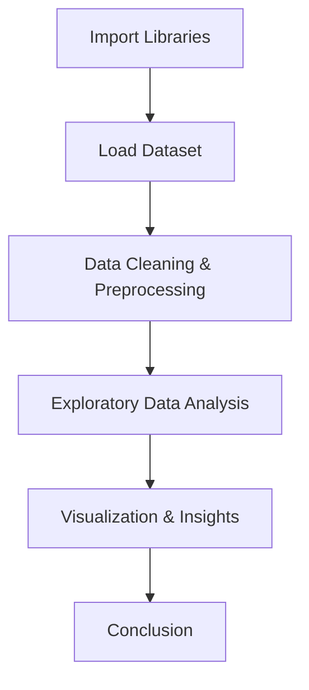

<div align="center">

# 🚗💥 **Task-05: Traffic Accident Data Analysis**

### *Prodigy Infotech — Data Science Internship (Task 05)*  
Analyze traffic accident data to uncover patterns related to **road conditions, weather, and time of day**,  
and visualize **accident hotspots** along with contributing factors.

---

</div>

<div align="center">
  
📘 **Dataset:**  
<a href="https://www.kaggle.com/datasets/sobhanmoosavi/us-accidents" target="_blank">
  
</a>

</div>

---

## 🧩 **Overview**
This project explores a large-scale **US Accident Dataset** to identify crucial insights about traffic behavior and accident risks.  
Using **Python** and **Data Visualization tools**, we analyze accident frequency, conditions, and severity trends to understand real-world road safety.

---

## ⚙️ **Tech Stack**

| Category | Tools / Libraries |
|-----------|------------------|
| 💻 **Language** | Python |
| 📦 **Libraries** | Pandas, NumPy, Matplotlib, Seaborn, Plotly |
| 🧠 **Environment** | Jupyter Notebook |
| 🚀 **Platform** | Prodigy Infotech Internship |

---

## 🧭 **Project Workflow**



---

## 🖼️ **Project Preview**

<div align="center">

|                                   Accident Trend by Time of Day                                   |                                           Weather Impact                                          |                                       Hotspot Visualization                                       |
| :-----------------------------------------------------------------------------------------------: | :-----------------------------------------------------------------------------------------------: | :-----------------------------------------------------------------------------------------------: |
|  |  |  |

> *(Replace the placeholder URLs above with your real image links from the GitHub “assets” section after uploading visuals.)*

</div>

---

## 📊 **Data Analysis & Visualizations**

* 📍 **Accident Distribution by Time of Day**
* 🌧️ **Weather Impact on Accidents**
* 🗺️ **Geographical Hotspots**
* 🔥 **Correlation Heatmap of Factors**

> Each visualization highlights how environmental and temporal factors contribute to accident frequency and severity.

---

## 💡 **Key Insights**

| Insight                    | Description                                                     |
| -------------------------- | --------------------------------------------------------------- |
| 🌧️ **Weather Conditions** | Rain, fog, and snow significantly increase accident likelihood. |
| 🕒 **Time of Day**         | Evening rush hours (4–7 PM) see the highest number of crashes.  |
| 🛣️ **Road Type**          | Highways and intersections show higher density of accidents.    |
| 🌫️ **Visibility**         | Poor visibility is a critical contributor to accident severity. |

---

## ✅ **Conclusion**

Through this project, we gained valuable insights into **traffic accident dynamics** and the role of external conditions.
These findings can help **authorities** and **drivers** enhance **road safety awareness** and **preventive strategies**.

---

<div align="center">

## ✨ **About This Project**

This project is part of the **Prodigy Infotech Data Science Internship** (Task-05).
It demonstrates **data wrangling**, **visual analytics**, and **real-world interpretation** skills using Python.

</div>

---

<div align="center">

### 👨‍💻 **Developed by:**

**Krushna Chandra Bindhani**
🎓 *Data Science Intern @ Prodigy Infotech*
📅 *October 2025*
🔗 [LinkedIn](https://www.linkedin.com/in/krushna-chandra-bindhani-1b1342275/)

</div>

---

<div align="center">

⭐ *If you like this project, don’t forget to give it a star on GitHub!* ⭐

</div>
```

Would you like me to now create a **ready-to-download `README.md` file** using this exact professional version (with image section and HTML styling)?
